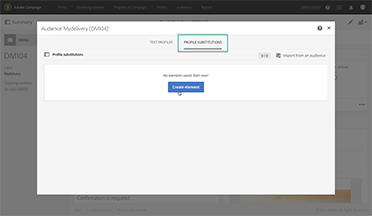
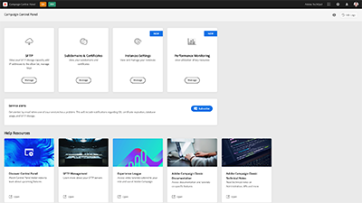

# Adobe Campaign Standard – Übersicht

Adobe Campaign bietet eine Plattform für die Konzeption kanalübergreifender Kundenerlebnisse, auf der über eine visuell-gestützte Umgebung Kampagnen orchestriert, Interaktionen in Echtzeit verwaltet und Kampagnen kanalübergreifend ausgeführt werden können. Dieses Benutzerhandbuch enthält Videos und Tutorials zu den verschiedenen Funktionen und Leistungsmerkmalen von Adobe Campaign Standard.

## Neue Funktionen

* **[Verfolgen Sie den Erfolg Ihrer Versand in Adobe Analytics.](/help/integrations/track-the-success-of-your-deliveries-in-analytics.md)**

   *Erfahren Sie, wie Sie die Integration von Campaign Standard und Analytics konfigurieren. Verstehen Sie, wie Sie einen Bericht in Analytics mit den von Campaign Standard erhaltenen Daten erstellen und welche KPIs verfügbar sind.*

* ** [Verwenden von Triggern für Transaktionsnachrichten](/help/integrations/using-triggers-for-transactional-messaging-overview.md)**

   *Erfahren Sie, wie Sie Trigger für Transaktionsnachrichten konfigurieren und verwenden.*

## Favoriten unserer Mitarbeiter

<table>
<tr>
  <td>
    
    

      <a href="./communication-channels/email/profile-substitution.md">
    <strong>Profilersetzung – Testen von E-Mail-Nachrichten mit Zielgruppenprofilen (Video)</strong>
    </a>
    

    

    <em>Erfahren Sie, wie Sie einen Testversand zur Überprüfung mit der genauen Darstellung der Nachricht durchführen können, die das Profil empfangen wird.</em>
    

  </td>
   <td>
    
    

    <a href="https://docs.adobe.com/content/help/de-DE/campaign-standard-learn/control-panel/control-panel-overview.html">
    <strong>Control Panel (Videos)</strong>
    </a>
    

    

    <em> Steigern Sie Ihre Effizienz als Administrator, indem Sie mit dem Control Panel die Einstellungen verwalten und die Nutzung Ihrer Instanzen verfolgen.</em>
    

  </td>
  <td>
    
    

      <a href="https://docs.adobe.com/content/help/en/campaign-standard-learn/getting-started-with-push-notifications-android/introduction.html">
    <strong>Tutorial: Erste Schritte mit Push-Benachrichtigungen für Android</strong>
    </a>
    

    

    <em>Dieses Tutorial führt Sie durch die Schritte, die für das Senden von Push-Benachrichtigungen von Adobe Campaign und den Empfang dieser Benachrichtigungen in Ihrer Android-App erforderlich sind. </em>
    

  </td>
</tr>
</table>

## Zusätzliche Ressourcen

* [Dokumentation](https://docs.adobe.com/content/help/de-DE/campaign-standard/using/campaign-standard-home.html)
