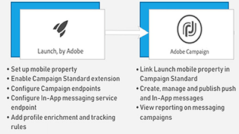

# Übersicht

Adobe Campaign bietet eine Plattform zur Konzeption kanalübergreifender Kundenerlebnisse und stellt dazu eine Umgebung für die Entwicklung visueller Kampagnen, die Verwaltung von Echtzeit-Interaktionen und die kanalübergreifende Umsetzung bereit. Dieses Benutzerhandbuch enthält Videos und Tutorials zu den zahlreichen Funktionen von Adobe Campaign Standard.

## Neue Funktionen

* **[Externe API-Aktivität](/help/managing-processes-and-data/data-management-activities/external-api-activity.md)**    
   *Erfahren Sie, wie Sie einen Workflow mit der Aktivität für externe API konfigurieren und ausführen.*

* **[Austausch von Profilen - Testen von E-Mail-Nachrichten mit zielgerichteten Profilen](/help/communication-channels/email/profile-substitution.md)**    
   *Erfahren Sie, wie Sie einen Testversand zur Überprüfung mit der genauen Darstellung der Nachricht senden, die das Profil erhalten wird.*

* **[Systemsteuerung - Google TXT-Datensatzverwaltung](/help/administrating/control-panel/google-txt-record-management.md)**    
   *Erfahren Sie, wie Sie allen Subdomänen, die zum Senden von E-Mails an GMAIL-Adressen verwendet werden, über die Systemsteuerung der Kampagne Google TXT-Site-Überprüfungsdatensätze hinzufügen.*

* **[Übung: Erste Schritte mit Push-Benachrichtigungen für Android](https://docs.adobe.com/content/help/en/campaign-standard-learn/getting-started-with-push-notifications-android/introduction.html)**    
   *Dieses Lernprogramm führt Sie durch die Schritte, die beim Senden von Push-Benachrichtigungen von Adobe Campaign und beim Empfangen dieser Benachrichtigungen in Ihrer Android-App erforderlich sind.*

## Personalauswahl

<table>
<tr>
  <td>
    
    

      <a href="./communication-channels/mobile/in-app/in-app-message-overview.md">
    <strong>In-App-Nachrichten (Tutorial)</strong>
    </a>
    

    

    <em>In-App-Nachrichten sind Kanal, mit denen Sie eine Meldung anzeigen können, wenn der Benutzer in einer Mobilanwendung aktiv ist.</em>
    

  </td>
   <td>
    
    

      <a href="./designing-content/email-designer/email-designer-overview.md">
    <strong>E-Mail-Designer (Videos)</strong>
    </a>
    

    

    <em>Der E-Mail-Designer ermöglicht die schnelle und mühelose visuelle Erstellung individueller E-Mails.</em>
    

  </td>
  <td>
    
    

      <a href="./designing-content/product-listings-in-transactional-email.md">
    <strong>Produktlisten (Tutorial)</strong>
    </a>
    

    

    <em>Erstellen Sie transaktionale E-Mails mit einer Liste von Produkten und Angeboten. </em>
    

  </td>
</tr>
</table>

## Zusätzliche Ressourcen

* [Dokumentation](https://docs.adobe.com/content/help/de-DE/campaign-standard/using/campaign-standard-home.html)
